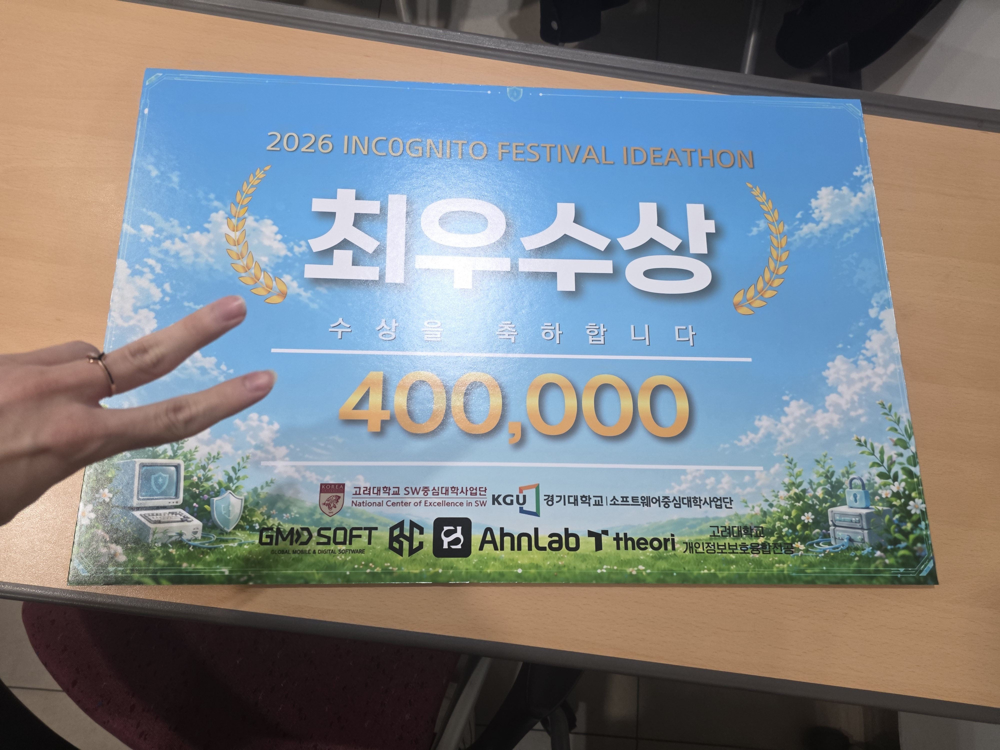
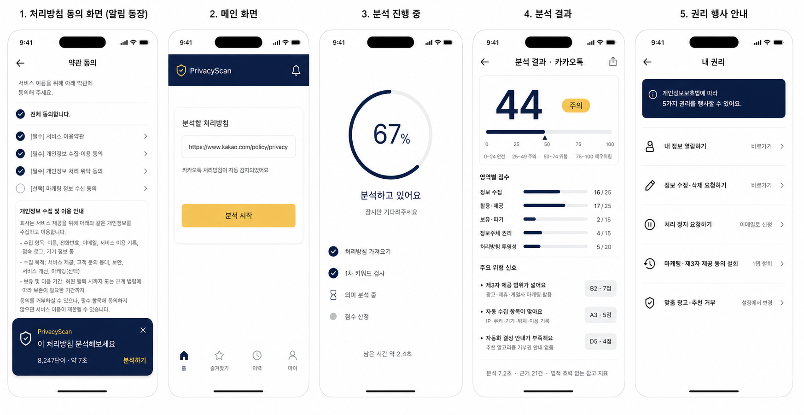

# PrivacyScan

개인정보처리방침의 위험도를 5영역 25항목 100점으로 점수화하는 AI 평가체계.

---

## 한 줄 소개

아무도 안 읽는 8,000단어 처리방침을 AI가 법적 기준으로 점수화하여, 이용자가 자신의 정보주체 권리를 지킬 수 있도록 돕는 서비스.

INC0GNITO 2026 아이디어톤 본선 최우수상 · 2026.05.08 · 고려대학교 정운오IT교양관

상장 실물 보기 <em>(임시 — 추후 운영진 PDF 원본으로 교체 예정)</em>

 

2026 INC0GNITO FESTIVAL IDEATHON · 최우수상
상금 400,000원 · 2026.05.08 · 고려대학교 정운오IT교양관

주최: 전국 대학생 보안동아리 연합 INCOGNITO
주관: 고려대학교 SW중심대학사업단 · 개인정보보호융합전공
후원: AhnLab · GMD Soft · theori · 경기대학교 소프트웨어중심대학사업단

---

## 데모

5단 흐름: URL 입력 → 처리방침 분석 → 0~100점 위험도 → 위험 조항 하이라이트 → 권리 행사 가이드

---

## 문제 정의

| 수치 | 의미 |
|------|------|
| 8,000단어 | 국내 주요 앱 처리방침 평균 분량 |
| 20분 | 정독 시 소요 시간 |
| 90% 이상 | 내용 확인 없이 동의 버튼을 누르는 비율 |

이용자는 자신이 무엇에 동의하는지 모른 채 정보주체 권리를 침해당하고 있다.

---

## 솔루션 — 5가지 기능

URL 하나로 처리방침을 분석하여:

1. 3줄 요약 — 긴 처리방침을 핵심만 압축
2. 위험 조항 하이라이트 — 원문 근거 자동 추출
3. 0~100점 위험도 — 5영역 25항목 체크리스트
4. 권리 행사 가이드 — 5대 권리 원스톱 안내
5. 변경 알림 — 처리방침 변경 자동 감지

---

## 평가체계

### 5영역 5항목 100점

| 영역 | 배점 | 세부 항목 |
|------|-----|----------|
| A. 정보 수집 범위 | 25점 | 과도한 수집·민감정보·자동수집·동의분리·취약계층 |
| B. 정보 활용·제공 | 25점 | 마케팅·제3자제공·목적외이용·위탁·국외이전 |
| C. 보유·파기 | 15점 | 탈퇴후보유·법정보관·파기절차·백업·휴면 |
| D. 정보주체 권리 | 15점 | 열람·정정·삭제·정지·자동화결정 |
| E. 처리방침 투명성 | 20점 | 구조·가독성·변경이력·책임자·요약 |

### 위험도 등급

`0~24` 안전 · `25~49` 주의 · `50~74` 위험 · `75+` 매우위험

### 점수 산정 4단계

원문 조항 → 평가항목 매핑 (LLM) → 평가코드 부여 → 단계형 룰 합산 (LLM 인상 X, 기계적 산식)

---

## 검증 결과 (파일럿)

| 지표 | 측정값 | 정의 |
|------|-------|------|
| 정탐률 (Recall) | 86.7% | 위험 후보 30건 중 26건 탐지 |
| 오탐률 (FPR) | 13.3% | 정상 30건 중 4건 과탐지 |
| 근거 표시율 | 100% | 21개 위험 항목 전건 원문 첨부 |
| 평가자 일치율 | 96% | 두 평가자 독립 채점 (허용오차 1점) |
| 처리시간 | 7.2초 | 평균 / p95 9.8초 |

7개 서비스 적용 결과: 당근마켓 20점에서 인스타그램 71점까지 (점수 분산 51점)

---

## 기술 스택

| 영역 | 기술 |
|------|-----|
| Backend | FastAPI (Python 3.12) |
| LLM | GPT-4o mini (1차) · sLLM 7B (온디바이스 옵션) |
| Crawler | Playwright + BeautifulSoup4 |
| Cache | Redis (24h TTL) |
| Frontend | React 18 + TypeScript + Tailwind |
| Browser Ext | Chrome Manifest V3 |
| Mobile | React Native (3단계) |
| Infra | AWS EC2 + RDS + S3 · Docker · GitHub Actions |

### 신뢰성 보장 구조

`Rule-based 1차 필터` → `LLM 2차 의미 분석` → `단계형 룰 점수화`

LLM은 분류만, 점수는 룰의 기계적 합산. LLM 환각이 점수에 영향을 주지 않는다.

### 개인정보 보호 3원칙

1. 공개 처리방침만 처리 — 사용자 로그인 정보 입력 X
2. LLM 요청 시 식별값 분리 — IP·계정·쿠키 미포함
3. 온디바이스 옵션 — sLLM 로컬 추론, 외부 전송 0건 모드

---

## 자료실

- [`docs/01_발표PPT.pptx`](docs/01_발표PPT.pptx) — 본선 발표 슬라이드 (12장)
- [`docs/02_발표대본.docx`](docs/02_발표대본.docx) — 슬라이드별 발표 대본과 Q&A
- [`docs/03_QnA답변카드.docx`](docs/03_QnA답변카드.docx) — 예상 질문 10개 답변
- [`docs/04_평가체크리스트.xlsx`](docs/04_평가체크리스트.xlsx) — 25항목 룰과 7서비스 채점
- [`docs/05_예선기획서.pdf`](docs/05_예선기획서.pdf) — 예선 통과 기획서

---

## 향후 구현 로드맵

자세한 내용은 [`ROADMAP.md`](ROADMAP.md) 참고.

- v0.1 — 평가체계 설계 (완료, 본선 수상)
- v0.2 — 백엔드 PoC (FastAPI + Playwright + GPT-4o mini)
- v0.3 — Chrome 확장 프로그램
- v0.4 — 모바일 앱 (React Native)
- v1.0 — 변경 알림과 권리 행사 가이드 자동화

---

## 팀 — 부천시 붉은악마

- 김주환 — 건국대학교 전기전자공학부 · [GitHub](https://github.com/rlawnghks1031)
- 정인겸 — 동양미래대학교 컴퓨터소프트웨어공학과 · [GitHub](https://github.com/jik0226)

---

## 면책

PrivacyScan은 법적 자문을 대체하지 않는다. KISA 가이드라인 기반 1차 필터링 도구이며, 결과는 법적 효력 없는 참고 지표이다. 위험은 위법이 아닌, 공개 처리방침 문서상 고지 위험 신호이다.

---

## 라이선스

본 저장소는 [MIT License](LICENSE)에 따라 배포된다.

발표 자료(PPT·대본·기획서)의 저작권은 부천시 붉은악마 팀(김주환·정인겸)에게 있으며, 인용 시 출처를 명시할 것.
